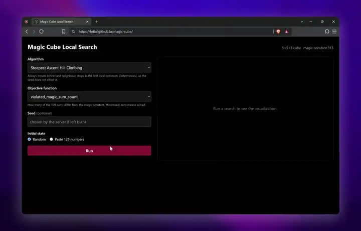
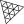

# F.E.T.I.

**F**aiz · **E**leanor · **T**halita · **I**rfan

Group 16 — two projects in search, optimization, and classification.

  
  
  
  

---

# Projects

## Magic Cube Solver

Six search algorithms racing a 5×5×5 diagonal magic cube — replayed move by move.

A 5×5×5 diagonal magic cube has 125 cells that must be a permutation of 1..125,
with all 109 rows, columns, pillars and diagonals summing to 315. Six local-search
and metaheuristic algorithms attack it server-side in Go, and the browser replays
the resulting swap log on a scrubber against a live objective-value plot.

The Genetic Algorithm is the exception. Being a population method it has no single
sequence of swaps, so it returns no trajectory — the interface charts it rather than
animating it.

**Algorithms**

`Steepest Ascent Hill Climbing` · `Hill Climbing with Sideways Move` ·
`Random Restart Hill Climbing` · `Stochastic Hill Climbing` ·
`Simulated Annealing` · `Genetic Algorithm`

**Built with**

   Go &nbsp;
  Fiber &nbsp;
   SvelteKit &nbsp;
   Three.js &nbsp;
   Chart.js &nbsp;
   Tailwind &nbsp;
   Vite &nbsp;
   Docker

**Links** — [Live demo](https://fetiai.github.io/magic-cube/) ·
[Front end](https://github.com/fetiai/magic-cube) ·
[Solver API](https://github.com/fetiai/magic-cube-core) ·
[Report (PDF, Indonesian)](https://github.com/fetiai/magic-cube/blob/master/doc/Tubes1_Kelompok16_18222023_18222056_18222059_18222063.pdf)

---

## Phishing URL Classifier

Two algorithms, each written twice — and the baseline that keeps them honest.

The UCI PhiUSIIL corpus runs 140,404 URLs deep and only 7.5% of it is hostile —
which is exactly why accuracy flatters here and recall does the real work. KNN and
Gaussian Naive Bayes are each built twice across its 49 features, once from scratch
and once from scikit-learn, so every number has a reference to answer to. Around
them the pipeline runs EDA, missing-value handling, outlier treatment, feature
engineering, scaling and SMOTE.

Dataset: [UCI PhiUSIIL Phishing URL Dataset](https://archive.ics.uci.edu/dataset/967/phiusiil+phishing+url+dataset)
(repository ID 967). Class 0 is phishing and is the positive class throughout.

**Algorithms**

`K-Nearest Neighbors (from scratch)` · `K-Nearest Neighbors (scikit-learn)` ·
`Gaussian Naive Bayes (from scratch)` · `Gaussian Naive Bayes (scikit-learn)` ·
`EDA` · `Feature Engineering` · `SMOTE`

**Results** — measured on a 28,081-row validation split.

| Model | Phishing recall | Accuracy | F1 |
|---|---|---|---|
| KNN (from scratch) | 0.759 | 0.9805 | 0.856 |
| KNN (scikit-learn) | 0.763 | 0.9807 | 0.859 |
| Gaussian NB (from scratch) | 0.788 | 0.9779 | 0.845 |
| Gaussian NB (scikit-learn) | 0.888 | 0.9819 | 0.883 |
| **Baseline — constant "legitimate"** | **0.000** | **0.9248** | **—** |

Read every accuracy against that 0.9248 baseline. The corpus is 92.48% legitimate, so
answering "legitimate" to everything scores 0.9248 while catching no phishing at all —
which is why phishing recall, not accuracy, is the number that actually moves. The
held-out file shipped with the dataset has no labels, so there is no test score and
none is claimed.

> **This is a coursework reimplementation, not a security product.** It is trained on a
> static 2023–24 dataset, has no threat intelligence, no blocklist, and no knowledge of
> any campaign newer than its training data. Do not use it to decide whether a link is safe.

**Built with**

   Python &nbsp;
   scikit-learn &nbsp;
   NumPy &nbsp;
   pandas &nbsp;
   SciPy &nbsp;
   Streamlit &nbsp;
   Jupyter &nbsp;
   Docker

**Links** — [Live demo](https://phiusiil.faizath.com) ·
[Repository](https://github.com/fetiai/phishing-url-classifier) ·
[Report (PDF, Indonesian)](https://github.com/fetiai/phishing-url-classifier/blob/main/doc/Tubes2_Kelompok16_18222023_18222056_18222059_18222063.pdf)

---

## Team

<table>
  <tr>
    <td width="220" align="center" valign="top">
      
        
      <b>Thalita Zahra Sutejo</b> 
      18222023
        
      <a href="https://github.com/thalitazhrr">
        
        thalitazhrr
      </a>
       
      <a href="https://www.linkedin.com/in/thalitazahras/">
        
        thalitazahras
      </a>
    </td>
    <td width="220" align="center" valign="top">
      
        
      <b>Irfan Musthofa</b> 
      18222056
        
      <a href="https://github.com/IrfanMusthofa">
        
        IrfanMusthofa
      </a>
       
      <a href="https://www.linkedin.com/in/irfanmusthofa/">
        
        irfanmusthofa
      </a>
    </td>
    <td width="220" align="center" valign="top">
      
        
      <b>Eleanor Cordelia</b> 
      18222059
        
      <a href="https://github.com/EleanorCordelia">
        
        EleanorCordelia
      </a>
       
      <a href="https://www.linkedin.com/in/eleanorcordelia/">
        
        eleanorcordelia
      </a>
    </td>
    <td width="220" align="center" valign="top">
      
        
      <b>Muhammad Faiz Atharrahman</b> 
      18222063
        
      <a href="https://github.com/faizath">
        
        faizath
      </a>
       
      <a href="https://www.linkedin.com/in/faizath/">
        
        faizath
      </a>
    </td>
  </tr>
</table>

---

IF3070 Foundations of Artificial Intelligence · STEI ITB · 2024/2025-1

More at **[fetiai.github.io](https://fetiai.github.io/)**

